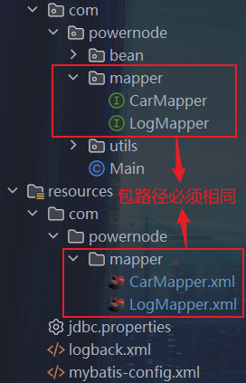

# 使用mybatis的一些小技巧

- 删除多条数据
  - `select * from t_car where id in (${ids})`
  - `select * from t_car where id = 1 or id = 2 ...`
- 模糊查询
  - `select * from t_car where brand like '%${brand}%'`
  - `select * from t_car where color like "%"#{brand}"%"`
  - `select * from t_car where brand like concat('%', #{brand}, '%')`
- MyBatis别名机制
```xml
    <!--
        <typeAliases>标签，用于给指定路径，起别名
        type="类或类目标名称"
        alias="别名" ==> 不区分大小写。
    -->
    <!-- alias属性，可以省略，默认为全限定类名的简写
        Eg: type="com.powernode.bean.Car" ==> 默认alias="car / Car..."不区分大小写。 -->
    
    <!-- 如果需要多个别名，可以使用package标签，配置多个别名目录 
        Eg: <package name="com.powernode.bean"/> mybatis会将此包下的所有类，起别名，默认简名-->
    <typeAliases>
        <!-- <typeAlias type="com.powernode.bean.Car" alias="car"/> -->
        <package name="com.powernode.bean"/>
    </typeAliases>
```
- MyBatis中的`mappers`标签包含
  - `mapper`标签
    - `mapper`标签中的属性包括
      - `resource`：映射文件的资源文件路径，mybatis会从项目根路径中，寻找映射文件。
        - ```xml
          <mappers>
            <mapper resource="com/powernode/mapper/AuthorMapper.xml"/>
          </mappers>
          ```
      - `url`：映射文件的绝对路径（一般不建议写绝对路径，会导致项目的移植性下降）
        - ```xml
          <mappers>
            <mapper url="file:///d:/.../com/powernode/mapper/AuthorMapper.xml"/>
          </mappers>
          ```
      - `class`：提供`mapper`接口的全限定接口名，必须带有包名
        - 并且这个`xml`文件，必须放在跟接口相同的包下
        - 
        - ```xml
          <mappers>
            <mapper class="com.powernode.mapper.CarMapper"/>
          </mappers>
          ```
  - `package`标签（最常用）
    - 前提：`xml`文件必须和接口放在一起，并且名字一致
    - ```xml
      <mappers>
        <package name="com.powernode.mapper"/>
      </mappers>
      ```