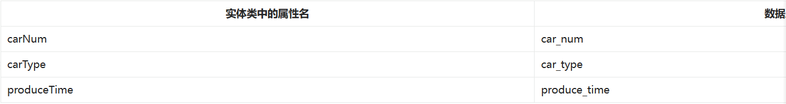

- Mybatis开启驼峰命名自动映射
  - 前提：
    - java符合驼峰命名规范
    - 数据库命名：全部小写，单词之间采用下划线连接
    - 
    ```xml
        <!--放在properties标签后面-->
        <settings>
            <setting name="mapUnderscoreToCamelCase" value="true"/>
        </settings>
    ```