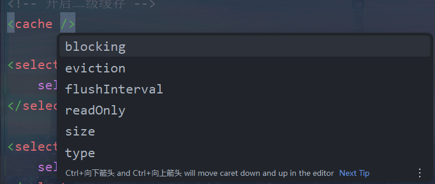

# MyBatis缓存
> MyBatis的缓存：将select语句的查询结果放到缓存（内存）中，当下一次执行相同的select语句的时候，
> 直接从缓存中取出，不必再查询数据库
> 一方面：减少IO操作；另一方面：不再执行繁琐的查找算法，使得效率大大提升

MyBatis缓存包括：
- 一级缓存：将查询到的数据存储到SqlSession中
- 二级缓存：将查询到的数据存储到SqlSessionFactory中
- 或者继承第三方缓存：
  - EaCache【Java语言开发】
  - MemCache 【C语言开发】
  - ...

**缓存只针对于DQL语句，也就是说缓存机制只对应select语句**

## 一级缓存
> 一级缓存默认是开启的，不需要做任何的配置

原理：只要使用**同一个SqlSession对象**执行同一条SQL语句，缓存机制就会生效

不走一级缓存： 
1. 不是同一个SqlSession对象
2. DQL的执行语句不同

一级缓存失效：
1. 手动清除缓存`sqlSession.clearCache();`
2. 在执行DQL语句之间，执行了增删改 ==> 清除缓存

## 二级缓存
> 二级缓存的范围是SqlSessionFactory对象

使用条件：
1. `<setting name="cacheEnabled" value="true"/>`进行全局开启或关闭所有映射器配置文件中已配置的任何缓存
    默认就是"true"，无需进行配置
2. 在需要使用二级缓存的`SqlMapper.xml`文件中配置：`<cache/>`
3. 使用二级缓存的实体类对象必须是**可序列化的**，也就是必须实现`java.io.Serializable`接口
4. **`SqlSession`对象关闭或提交之后**，一级缓存中的数据才会被写入到二级缓存中
   此时二级缓存才可以使用

### 二级缓存的配置

1. `eviction`：指定从缓存中一处某个对象的淘汰算法，默认采用LRU策略
    - LRU(Least Recently Used)：最近最少使用，优先淘汰在间隔时间内使用频率最低的对象
      - (还有一种LFU淘汰算法，最不常用)
    - FIFO(First In First Out)：一种先进先出的数据缓存器，先进入二级缓存的对象最先被淘汰
    - SOFT：软引用，淘汰软引用指向的对象，具体算法和JVM垃圾回收算法有关
    - WEAK：弱引用，淘汰弱引用指向的对象，具体算法和JVM垃圾回收算法有关
2. `flushInterval`：二级缓存的刷新时间(毫秒)
                    如果没有设置，就代表不刷新缓存，只要内存够大，会一直向二级缓存中缓存数据
                    除非执行了增删改
3. `realOnly`
   - true：多条相同的SQL语句执行之后，返回的对象是共享的同一个
           性能好，但是多线程并发可能会存在安全问题
   - false：多条相同的SQL语句执行之后，返回的对象是副本
            调用了clone方法，性能一般，但是安全
4. `size`：设置二级缓存中最多可储存的java对象数量，默认值1024