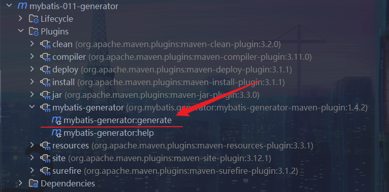

# MyBatis逆向工程
> 逆向工程：根据数据库表，逆向生成Java的[bean | pojo | domain ...]类
>          SqlMapper.xml文件、Mapper接口类等...

逆向工程的完成，需要借助MyBatis的逆向工程插件
配置的信息：
- bean类名、包名以及生成的位置
- SqlMapper.xml文件名以及生成位置
- Mapper接口名以及生成位置
- 连接数据库的信息
- 指定哪些表，参与逆向工程
- ...

## 逆向工程的配置
### 在项目的`pom.xml`文件中添加逆向工程插件
```xml
<!-- 定制构建过程 -->
<build>
    <!-- 可配置多个插件 -->
    <plugins>
        <!-- 其中的一个插件：mybatis逆向工程插件 -->
        <plugin>
            <!-- 插件的GAV坐标 -->
            <groupId>org.mybatis.generator</groupId>
            <artifactId>mybatis-generator-maven-plugin</artifactId>
            <version>1.4.2</version>
            <!-- 允许覆盖 -->
            <configuration>
                <overwrite>true</overwrite>
            </configuration>
            <!-- 插件的依赖 -->
            <dependencies>
                <!-- mysql驱动 -->
                <dependency>
                    <groupId>mysql</groupId>
                    <artifactId>mysql-connector-java</artifactId>
                    <version>8.0.32</version>
                </dependency>
            </dependencies>
        </plugin>
    </plugins>
</build>
```

### 配置`generatorConfig.xml`文件
> 文件名必须是：`generatorConfig.xml`
> 配置文件，必须放在**类的根路径**下
```xml
<?xml version="1.0" encoding="UTF-8"?>
<!DOCTYPE generatorConfiguration
        PUBLIC "-//mybatis.org//DTD MyBatis Generator Configuration 1.0//EN"
        "http://mybatis.org/dtd/mybatis-generator-config_1_0.dtd">

<generatorConfiguration>
    <!--
        targetRuntime有两个值：
            MyBatis3Simple：生成的是基础版，只有基本的增删改查。
            MyBatis3：生成的是增强版，除了基本的增删改查之外还有复杂的增删改查。
    -->
    <context id="DB2Tables" targetRuntime="MyBatis3">
        <!--防止生成重复代码-->
        <plugin type="org.mybatis.generator.plugins.UnmergeableXmlMappersPlugin"/>

        <commentGenerator>
            <!--是否去掉生成日期-->
            <property name="suppressDate" value="true"/>
            <!--是否去除注释-->
            <property name="suppressAllComments" value="true"/>
        </commentGenerator>

        <!--连接数据库信息-->
        <jdbcConnection driverClass="com.mysql.cj.jdbc.Driver"
                        connectionURL="jdbc:mysql://localhost:3306/powernode"
                        userId="root"
                        password="root">
        </jdbcConnection>

        <!-- 生成pojo包名和位置 -->
        <javaModelGenerator targetPackage="com.powernode.mybatis.pojo" targetProject="src/main/java">
            <!--是否开启子包-->
            <property name="enableSubPackages" value="true"/>
            <!--是否去除字段名的前后空白-->
            <property name="trimStrings" value="true"/>
        </javaModelGenerator>

        <!-- 生成SQL映射文件的包名和位置 -->
        <sqlMapGenerator targetPackage="com.powernode.mybatis.mapper" targetProject="src/main/resources">
            <!--是否开启子包-->
            <property name="enableSubPackages" value="true"/>
        </sqlMapGenerator>

        <!-- 生成Mapper接口的包名和位置 -->
        <javaClientGenerator
                type="xmlMapper"
                targetPackage="com.powernode.mybatis.mapper"
                targetProject="src/main/java">
            <property name="enableSubPackages" value="true"/>
        </javaClientGenerator>

        <!-- 表名和对应的实体类名-->
        <table tableName="t_car" domainObjectName="Car"/>

    </context>
</generatorConfiguration>
```
### 运行插件

