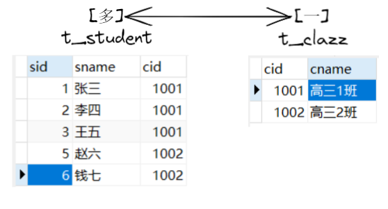

# MyBatis高级映射及延迟加载
##  多对一

> 常见的方式包括三种：
> - 第一种：一条SQL语句，级联属性映射
> - 第二种：一条SQL语句，`association`
> - 第三种：两条SQL语句分步查询(常用)
>   - 优点：
>     - 代码复用性高
>     - 支持懒加载(延迟加载)，**提高性能**，默认不开启延迟加载
>       - 懒加载：使用的时候再加载，不用的时候不会加载
>       - 尽可能不查，或尽可能少查

### 级联属性映射
> 在主表中，添加子表的对象

如何判断，**主表**还是**子表**？



多对一（多个学生，对应一个班级） ：主表就是"多"，子表就是"一"

一对多：主表就是"一"，子表就是"多"

即在`Student`类中添加`Clazz`对象的属性
```java
public class Student {
    private Integer sId;
    private String sName;
    private Clazz clazz;
    // ...
}
```
```xml
<!-- 层联属性映射 -->
<resultMap id="studentResultMap" type="Student">
    <id property="sid" column="sid"/>
    <result property="sname" column="sname"/>
    <result property="clazz.cid" column="cid"/>
    <result property="clazz.cname" column="cname"/>
</resultMap>
```

### association
使用`<resultMap>`标签中的`<Association>`标签进行配置
```xml
<!-- 一条SQL，association(关联)方式 -->
<resultMap id="studentResultMapAssociation" type="Student">
    <id property="sid" column="sid"/>
    <result property="sname" column="sname"/>

    <!--
        association: 关联的意思，一个Student对象关联一个Clazz对象
        property: 提供需要映射的[bean | pojo | domain ...]类属性名
        javaType: 指定需要映射的java类型
     -->
    <association property="clazz" javaType="Clazz">
        <id property="cid" column="cid"/>
        <result property="cname" column="cname"/>
    </association>
</resultMap>
```
### 两条SQL语句，分步查询
```xml
<!-- StudentMapper.xml -->

<resultMap id="studentResultMapStep" type="Student">
    <id property="sid" column="sid"/>
    <result property="sname" column="sname"/>

    <!--
        select: 进行下一步需要执行的SQL语句的id
        column: 指定下一步传值的字段，为下一条语句的#{}传值
                名称，需要根据所查出的值的名称
                    例如：select sid, sname, cid from t_student where sid = #{id}
                    需要传入cid的值，那么它的名字为："cid"
                    如果将cid起别名: select sid, sname, cid as abc from t_student where sid = #{id}
                    那么所传值的名称需为："abc"
        fetchType="lazy": 开启**局部**懒加载，当需要用到select指定的SQL语句才进行加载
                          无用时，不加载。。。
        fetchType="eager": 关闭**局部**延迟加载
    -->
    <association property="clazz"
                 select="com.powernode.mapper.ClazzMapper.selectByIdStep2"
                 column="cid"
                 fetchType="lazy"/>
</resultMap>

<!-- 分步查询，第一步 -->
<select id="selectByIdStep1" resultMap="studentResultMapStep">
select * from t_student where sid = #{id}
</select>
```
```xml
<!-- ClazzMapper.xml -->

<!-- 分步查询第二步 -->
<select id="selectByIdStep2" resultType="Clazz">
    select * from t_clazz where cid = #{cid}
</select>
```
- 开启全局的懒加载
- 在`mybatis-config.xml`文件中进行设置全局属性
- > 作用：当使用分步映射时，开启懒加载
- ```xml
  <!-- 开启全局懒加载 -->
  <setting name="lazyLoadingEnabled" value="true"/>
  ```

## 一对多
一个班级，对应多个学生
> 在主表中添加集合或数组，对应多个子表对象

```java
public class Clazz {
    private Integer cid;
    private String cname;
    private List<Student> students;
    // ...
}
```
- 两种实现方式：
  - `collection`
  - 分步查询

### collection
```xml
<resultMap id="clazzResultMap" type="Clazz">
    <id property="cid" column="cid"/>
    <result property="cname" column="cname"/>

    <!--
        property: 集合的属性名
        ofType: 集合中存放的类型
    -->
    <collection property="students" ofType="Student">
        <id property="sid" column="sid"/>
        <result property="sname" column="sname"/>
    </collection>
</resultMap>
```

### 分步查询
```xml
<!-- ClazzMapper.xml -->
<resultMap id="clazzResultMapStep" type="Clazz">
  <result property="cid" column="cid"/>
  <result property="cname" column="cname"/>

  <collection property="students"
              select="com.powernode.mapper.StudentMapper.selectByIdStep2"
              column="cid"/>
</resultMap>

<select id="selectByIdStep1" resultMap="clazzResultMapStep">
select * from t_clazz where cid = #{cid}
</select>
```
```xml
<!-- StudentMapper.xml -->
<select id="selectByIdStep2" resultType="Student">
  select * from t_student where cid = #{cid}
</select>
```

